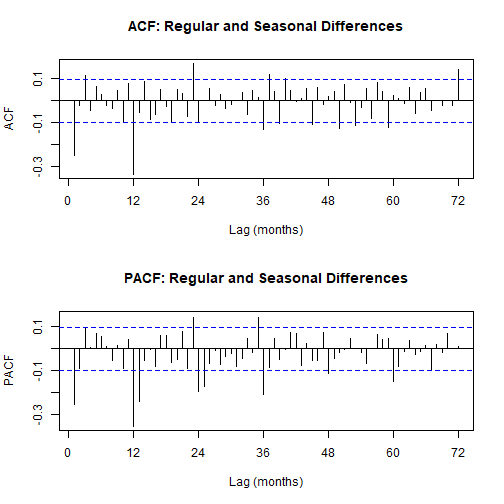
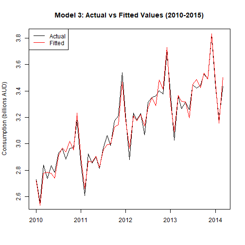

## Carga de paquetes y datos


```r
library(forecast)
source("BoxCoxTransformation.R")
require(astsa)         # load astsa
source("Diagnostic.R")  #(load the functions in "diagnostic")
require(portes)       # load portes  (Ljung-Box test, McLeod-Li_83 test)
# require(Nortes)
```

Importamos los datos de la serie temporal


```r
data = read.table("data9.txt", header = TRUE)
```

## Análisis Exploratorio (EDA)
Creamos el objeto de serie temporal


```r
z <- ts(data[,1], start = c(1980, 4), frequency = 12)
```

### Visualización de la serie original


```r
ts.plot(z, main = "Total monthly expenditure on cafes, restaurants and takeaway food services in Australia, April 1980 - April 2015", 
        ylab = "Consumption (in billions of dollars)")
```


### Gráfico estacional


```r
ggseasonplot(z, main = "Seasonal plot: Total monthly expenditure on cafes, restaurants and takeaway food")
```


**Observaciones iniciales:**
- Presencia de componente de tendencia creciente
- Estacionalidad anual evidente (s=12)
- Variabilidad no constante (heterocedasticidad)
## Transformación Box-Cox


```r
Plot.var(z, 12)
```


```r
BoxCox(z, 12)
```


**Resultado de la transformación:**
- Lambda óptimo = 0.2
- No es necesario usar transformación logarítmica


```r
X.tilde = (z**0.2 - 1)/0.2
ts.plot(X.tilde, main = "Serie transformada con Box-Cox (λ=0.2)")
```


### Función de Autocorrelación (ACF)


```r
Acf(X.tilde, main = "ACF de la serie transformada", xlab = "Lag", ylab = "ACF")
```


## Diferenciación para lograr estacionariedad
### Primera diferencia regular


```r
Wt.1 = diff(X.tilde, lag = 1, differences = 1)
ts.plot(as.numeric(Wt.1), xlab = "", ylab = "", 
        main = "Primera diferencia regular de la serie transformada")
```


```r
ggseasonplot(Wt.1, main = "Gráfico estacional de la primera diferencia")
```


### Primera diferencia estacional


```r
Wt.2 = diff(Wt.1, lag = 12, differences = 1)
ts.plot(as.numeric(Wt.2), xlab = "", ylab = "", 
        main = "Primeras diferencias regular y estacional", type = "l")
```



### ACF y PACF de la serie diferenciada


```r
acf.2 = Acf(Wt.2, 80, main = "ACF: Diferencias regular y estacional", 
            xlab = "Lag", ylab = "ACF")
```


```r
pacf.2 = Pacf(Wt.2, 80, main = "PACF: Diferencias regular y estacional", 
              xlab = "Lag", ylab = "PACF")
```


**Identificación de modelo:**
- Componente MA(1) regular
- Componente MA(1) o SMA(1) estacional
- Posible componente AR estacional
## Ajuste de modelos SARIMA


```r
mod1 = Arima(z, order = c(2,1,1), seasonal = list(order = c(3,1,1), period = 12), lambda = 0.2)
mod2 = Arima(z, order = c(2,1,1), seasonal = list(order = c(5,1,1), period = 12), lambda = 0.2)
mod3 = Arima(z, order = c(3,1,1), seasonal = list(order = c(3,1,1), period = 12), lambda = 0.2)
mod4 = Arima(z, order = c(0,1,1), seasonal = list(order = c(2,1,2), period = 12), lambda = 0.2)
mod5 = Arima(z, order = c(0,1,1), seasonal = list(order = c(3,1,1), period = 12), lambda = 0.2)
mod6 = Arima(z, order = c(0,1,1), seasonal = list(order = c(3,1,2), period = 12), lambda = 0.2)
mod7 = Arima(z, order = c(1,1,0), seasonal = list(order = c(3,1,1), period = 12), lambda = 0.2)

modelos <- list(mod1, mod2, mod3, mod4, mod5, mod6, mod7)
names(modelos) <- paste0("mod", 1:7)
```

## Comparación de modelos
Creación de tabla comparativa


```r
tabla_resultados <- data.frame()
for (nombre in names(modelos)) {
  mod <- modelos[[nombre]]
  acc <- accuracy(mod)
  
  rmse_val <- acc["Training set", "RMSE"]
  
  tabla_resultados <- rbind(tabla_resultados, data.frame(
    Model = nombre,
    AIC = round(mod$aic, 2),
    AICc = round(mod$aicc, 2),
    BIC = round(mod$bic, 2),
    RMSE = round(rmse_val, 6),
    MAE = round(acc["Training set", "MAE"], 4)
  ))
}
```

### Tabla comparativa de métricas


```r
library(dplyr)
library(kableExtra)

best_AIC <- min(tabla_resultados$AIC)
best_AICc <- min(tabla_resultados$AICc)
best_BIC <- min(tabla_resultados$BIC)
best_RMSE <- min(tabla_resultados$RMSE)
best_MAE <- min(tabla_resultados$MAE)
```

## Diagnóstico de residuos
### Pruebas de Ljung-Box personalizadas


```r
My.Ljung.Box.FixedK <- function(x, np, k) {
  n <- length(x)
  SampleACF <- as.numeric(unlist(Acf(x, lag.max = k, plot = FALSE)))[2:(k + 1)]
  Q.ML <- n * (n + 2) * sum((SampleACF^2) / (n - seq_len(k)))
  pval <- 1 - pchisq(Q.ML, df = k - np)
  data.frame(k = k, Test_Statistic = Q.ML, P_value = pval)
}
```

### Pruebas no paramétricas


```r
NonParametric.Tests(mod2$residuals)    
```

```
##                      Test Statistic    P-value
## Turning Point test       0.03922624 0.96871001
## Difference-sign Test     1.79853241 0.07209268
## Rank Test                0.26016592 0.79473579
```

```r
NonParametric.Tests(mod3$residuals)    
```

```
##                      Test Statistic   P-value
## Turning Point test        0.4314887 0.6661131
## Difference-sign Test      0.4282220 0.6684895
## Rank Test                 0.2267368 0.8206284
```

```r
NonParametric.Tests(mod5$residuals)    
```

```
##                      Test Statistic   P-value
## Turning Point test        0.6668462 0.5048704
## Difference-sign Test      0.0856444 0.9317491
## Rank Test                 0.1671457 0.8672554
```

### Pruebas de normalidad


```r
Check.normality(mod2$residuals)
```

```
##                    Statistics P-value
## Shapiro-Wilxs          0.9957  0.3232
## Lilliefors             0.0434  0.0634
## Pearson Chi.square    24.8284  0.2081
```

```r
Check.normality(mod3$residuals)
```


```
##                    Statistics P-value
## Shapiro-Wilxs          0.9959  0.3787
## Lilliefors             0.0412  0.0943
## Pearson Chi.square    19.6422  0.4805
```

```r
Check.normality(mod5$residuals)
```


```
##                    Statistics P-value
## Shapiro-Wilxs          0.9965  0.5068
## Lilliefors             0.0294  0.5294
## Pearson Chi.square    14.4559  0.8067
```


## Validación y pronóstico
### Serie observada vs ajustada (Modelo 3)


```r
plot(seq(1,408), z, ylab = "Consumption (in billions of dollars)",
     xlab = "", type = "l", main = "Ajuste del Modelo 3")
points(seq(1,408), forecast(mod3)$fitted, col = "red", type = "l")
legend("topleft", legend = c("Observado", "Ajustado"), 
       col = c("black", "red"), lty = 1)
```



### Pronóstico a 30 meses


```r
Predic.mod = forecast(mod3, 30)
plot(Predic.mod, main = "Pronóstico de gastos a 30 meses")
```


