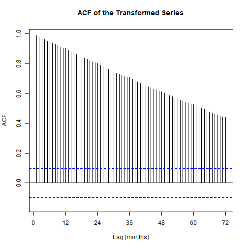
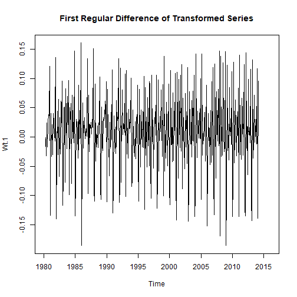

## Loading Packages and Data


Importing the time series data


```r
data = read.table("data9.txt", header = TRUE)
```

## Exploratory Data Analysis (EDA)
Creating the time series object


```r
z <- ts(data[,1], start = c(1980, 4), frequency = 12)
```

### Original Series Visualization


```r
ts.plot(z, main = "Total Monthly Expenditure on Cafes, Restaurants and Takeaway Food Services in Australia (Apr 1980 - Apr 2015)", 
        ylab = "Consumption (in billions of dollars)", 
        xlim = c(1980, 2016))
```


### Seasonal Plot


```r
ggseasonplot(z, main = "Seasonal Plot: Monthly Food Services Expenditure", 
             year.labels = TRUE, year.labels.left = TRUE) +
  theme(legend.position = "bottom")
```


**Initial observations:**
- Clear upward trend component
- Annual seasonality evident (s=12)
- Increasing variance over time (heteroscedasticity)
- Need for variance-stabilizing transformation
## Box-Cox Transformation


```r
Plot.var(z, 12)
```


```r
BoxCox(z, 12)
```


**Transformation results:**
- Optimal lambda = 0.2
- Not close enough to zero for log transformation


```r
X.tilde = (z**0.2 - 1)/0.2
ts.plot(X.tilde, main = "Box-Cox Transformed Series (λ=0.2)", 
        xlim = c(1980, 2016))
```


### Autocorrelation Function (ACF)


```r
Acf(X.tilde, lag.max = 72, 
    main = "ACF of the Transformed Series", 
    xlab = "Lag (months)", ylab = "ACF")
```



## Differencing for Stationarity
### First Regular Difference


```r
Wt.1 = diff(X.tilde, lag = 1, differences = 1)
ts.plot(Wt.1, 
        main = "First Regular Difference of Transformed Series", 
        xlim = c(1980, 2016))
```



### First Seasonal Difference


```r
Wt.2 = diff(Wt.1, lag = 12, differences = 1)
ts.plot(Wt.2, 
        main = "Regular and Seasonal Differences (1,1)", 
        xlim = c(1980, 2016))
```


### ACF and PACF of Differenced Series


```r
par(mfrow = c(2, 1))
Acf(Wt.2, lag.max = 72, 
    main = "ACF: Regular and Seasonal Differences", 
    xlab = "Lag (months)", ylab = "ACF")
Pacf(Wt.2, lag.max = 72, 
     main = "PACF: Regular and Seasonal Differences", 
     xlab = "Lag (months)", ylab = "PACF")
```


```r
par(mfrow = c(1, 1))
```

**Model identification:**
- Regular MA(1) component (lag 1 spike)
- Seasonal MA(1) component (lag 12 spike)
- Possible seasonal AR component (geometric decay at seasonal lags)
- Significant spike at lag 24 suggests SMA(2) component
## SARIMA Model Fitting
Fitting candidate SARIMA models


```r
mod1 = Arima(z, order = c(2,1,1), seasonal = list(order = c(3,1,1), period = 12), lambda = 0.2)
mod2 = Arima(z, order = c(2,1,1), seasonal = list(order = c(5,1,1), period = 12), lambda = 0.2)
mod3 = Arima(z, order = c(3,1,1), seasonal = list(order = c(3,1,1), period = 12), lambda = 0.2)
mod4 = Arima(z, order = c(0,1,1), seasonal = list(order = c(2,1,2), period = 12), lambda = 0.2)
mod5 = Arima(z, order = c(0,1,1), seasonal = list(order = c(3,1,1), period = 12), lambda = 0.2)
mod6 = Arima(z, order = c(0,1,1), seasonal = list(order = c(3,1,2), period = 12), lambda = 0.2)
mod7 = Arima(z, order = c(1,1,0), seasonal = list(order = c(3,1,1), period = 12), lambda = 0.2)

models <- list(mod1, mod2, mod3, mod4, mod5, mod6, mod7)
names(models) <- paste0("mod", 1:7)
```

## Model Comparison
Creating comparison table


```r
modelos <- list(
  mod1 = mod1,
  mod2 = mod2,
  mod3 = mod3,
  mod4 = mod4,
  mod5 = mod5,
  mod6 = mod6,
  mod7 = mod7
)

# Create dataframe with metrics
tabla_resultados <- data.frame()
for (nombre in names(modelos)) {
  mod <- modelos[[nombre]]
  acc <- accuracy(mod)
  
  rmse_val <- acc["Training set", "RMSE"]
  
  tabla_resultados <- rbind(tabla_resultados, data.frame(
    Model = nombre,
    AIC = round(mod$aic, 2),
    AICc = round(mod$aicc, 2),
    BIC = round(mod$bic, 2),
    RMSE = round(rmse_val, 6),
    MAE = round(acc["Training set", "MAE"], 4)
  ))
}

# Identify best values
best_AIC <- min(tabla_resultados$AIC)
best_AICc <- min(tabla_resultados$AICc)
best_BIC <- min(tabla_resultados$BIC)
best_RMSE <- min(tabla_resultados$RMSE)
best_MAE <- min(tabla_resultados$MAE)

# Define colors
color_texto <- "#111111"  # Very dark gray (almost black)
color_resaltado <- "#90EE90"  # Light green for highlighting
color_encabezado <- "#3498db"  # Blue for header

# Create table with highlighted cells and dark text
tabla_formateada <- tabla_resultados %>%
  mutate(
    AIC = cell_spec(AIC, "html", 
                    background = ifelse(AIC == best_AIC, color_resaltado, "white"),
                    color = color_texto),
    AICc = cell_spec(AICc, "html", 
                     background = ifelse(AICc == best_AICc, color_resaltado, "white"),
                     color = color_texto),
    BIC = cell_spec(BIC, "html", 
                    background = ifelse(BIC == best_BIC, color_resaltado, "white"),
                    color = color_texto),
    RMSE = cell_spec(RMSE, "html", 
                     background = ifelse(RMSE == best_RMSE, color_resaltado, "white"),
                     color = color_texto),
    MAE = cell_spec(MAE, "html", 
                    background = ifelse(MAE == best_MAE, color_resaltado, "white"),
                    color = color_texto)
  ) %>%
  kable(align = "c", escape = FALSE, format = "html",
        caption = "Monthly Expenditure on Food Services (Australia, Apr 1980–Apr 2015) - Model comparison") %>%
  kable_styling(
    bootstrap_options = c("striped", "hover", "condensed", "responsive"),
    full_width = FALSE,
    position = "center",
    font_size = 12
  ) %>%
  row_spec(0, bold = TRUE, background = color_encabezado, color = "white") %>%
  column_spec(1, bold = TRUE, color = color_texto) %>%
  add_header_above(c(" " = 1, "Likelihood Criteria" = 3, "Error Metrics" = 2),
                   background = color_encabezado, color = "white") %>%
  footnote(general = "The RMSE represents the square root of the MSE<br>Green cells highlight optimal values (lowest for all metrics)",
           general_title = "Note:",
           footnote_as_chunk = TRUE,
           escape = FALSE)

tabla_formateada
```

<table class="table table-striped table-hover table-condensed table-responsive" style="font-size: 12px; width: auto !important; margin-left: auto; margin-right: auto;border-bottom: 0;">
<caption style="font-size: initial !important;">Monthly Expenditure on Food Services (Australia, Apr 1980–Apr 2015) - Model comparison</caption>
 <thead>
<tr>
<th style="empty-cells: hide;border-bottom:hidden;" colspan="1"></th>
<th style="border-bottom:hidden;padding-bottom:0; padding-left:3px;padding-right:3px;text-align: center; color: white !important;padding-right: 4px; padding-left: 4px; background-color: rgba(52, 152, 219, 255) !important;" colspan="3"><div style="border-bottom: 1px solid #ddd; padding-bottom: 5px; ">Likelihood Criteria</div></th>
<th style="border-bottom:hidden;padding-bottom:0; padding-left:3px;padding-right:3px;text-align: center; color: white !important;padding-right: 4px; padding-left: 4px; background-color: rgba(52, 152, 219, 255) !important;" colspan="2"><div style="border-bottom: 1px solid #ddd; padding-bottom: 5px; ">Error Metrics</div></th>
</tr>
  <tr>
   <th style="text-align:center;font-weight: bold;color: white !important;background-color: rgba(52, 152, 219, 255) !important;"> Model </th>
   <th style="text-align:center;font-weight: bold;color: white !important;background-color: rgba(52, 152, 219, 255) !important;"> AIC </th>
   <th style="text-align:center;font-weight: bold;color: white !important;background-color: rgba(52, 152, 219, 255) !important;"> AICc </th>
   <th style="text-align:center;font-weight: bold;color: white !important;background-color: rgba(52, 152, 219, 255) !important;"> BIC </th>
   <th style="text-align:center;font-weight: bold;color: white !important;background-color: rgba(52, 152, 219, 255) !important;"> RMSE </th>
   <th style="text-align:center;font-weight: bold;color: white !important;background-color: rgba(52, 152, 219, 255) !important;"> MAE </th>
  </tr>
 </thead>
<tbody>
  <tr>
   <td style="text-align:center;font-weight: bold;color: rgba(17, 17, 17, 255) !important;"> mod1 </td>
   <td style="text-align:center;"> <span style="     color: rgba(17, 17, 17, 255) !important;border-radius: 4px; padding-right: 4px; padding-left: 4px; background-color: white !important;">-1784.71</span> </td>
   <td style="text-align:center;"> <span style="     color: rgba(17, 17, 17, 255) !important;border-radius: 4px; padding-right: 4px; padding-left: 4px; background-color: white !important;">-1784.33</span> </td>
   <td style="text-align:center;"> <span style="     color: rgba(17, 17, 17, 255) !important;border-radius: 4px; padding-right: 4px; padding-left: 4px; background-color: white !important;">-1752.87</span> </td>
   <td style="text-align:center;"> <span style="     color: rgba(17, 17, 17, 255) !important;border-radius: 4px; padding-right: 4px; padding-left: 4px; background-color: white !important;">0.036084</span> </td>
   <td style="text-align:center;"> <span style="     color: rgba(17, 17, 17, 255) !important;border-radius: 4px; padding-right: 4px; padding-left: 4px; background-color: white !important;">0.0258</span> </td>
  </tr>
  <tr>
   <td style="text-align:center;font-weight: bold;color: rgba(17, 17, 17, 255) !important;"> mod2 </td>
   <td style="text-align:center;"> <span style="     color: rgba(17, 17, 17, 255) !important;border-radius: 4px; padding-right: 4px; padding-left: 4px; background-color: rgba(144, 238, 144, 255) !important;">-1786.03</span> </td>
   <td style="text-align:center;"> <span style="     color: rgba(17, 17, 17, 255) !important;border-radius: 4px; padding-right: 4px; padding-left: 4px; background-color: rgba(144, 238, 144, 255) !important;">-1785.46</span> </td>
   <td style="text-align:center;"> <span style="     color: rgba(17, 17, 17, 255) !important;border-radius: 4px; padding-right: 4px; padding-left: 4px; background-color: white !important;">-1746.24</span> </td>
   <td style="text-align:center;"> <span style="     color: rgba(17, 17, 17, 255) !important;border-radius: 4px; padding-right: 4px; padding-left: 4px; background-color: rgba(144, 238, 144, 255) !important;">0.035744</span> </td>
   <td style="text-align:center;"> <span style="     color: rgba(17, 17, 17, 255) !important;border-radius: 4px; padding-right: 4px; padding-left: 4px; background-color: white !important;">0.026</span> </td>
  </tr>
  <tr>
   <td style="text-align:center;font-weight: bold;color: rgba(17, 17, 17, 255) !important;"> mod3 </td>
   <td style="text-align:center;"> <span style="     color: rgba(17, 17, 17, 255) !important;border-radius: 4px; padding-right: 4px; padding-left: 4px; background-color: white !important;">-1782.5</span> </td>
   <td style="text-align:center;"> <span style="     color: rgba(17, 17, 17, 255) !important;border-radius: 4px; padding-right: 4px; padding-left: 4px; background-color: white !important;">-1782.04</span> </td>
   <td style="text-align:center;"> <span style="     color: rgba(17, 17, 17, 255) !important;border-radius: 4px; padding-right: 4px; padding-left: 4px; background-color: white !important;">-1746.69</span> </td>
   <td style="text-align:center;"> <span style="     color: rgba(17, 17, 17, 255) !important;border-radius: 4px; padding-right: 4px; padding-left: 4px; background-color: white !important;">0.035997</span> </td>
   <td style="text-align:center;"> <span style="     color: rgba(17, 17, 17, 255) !important;border-radius: 4px; padding-right: 4px; padding-left: 4px; background-color: rgba(144, 238, 144, 255) !important;">0.0256</span> </td>
  </tr>
  <tr>
   <td style="text-align:center;font-weight: bold;color: rgba(17, 17, 17, 255) !important;"> mod4 </td>
   <td style="text-align:center;"> <span style="     color: rgba(17, 17, 17, 255) !important;border-radius: 4px; padding-right: 4px; padding-left: 4px; background-color: white !important;">-1780.89</span> </td>
   <td style="text-align:center;"> <span style="     color: rgba(17, 17, 17, 255) !important;border-radius: 4px; padding-right: 4px; padding-left: 4px; background-color: white !important;">-1780.67</span> </td>
   <td style="text-align:center;"> <span style="     color: rgba(17, 17, 17, 255) !important;border-radius: 4px; padding-right: 4px; padding-left: 4px; background-color: white !important;">-1757.02</span> </td>
   <td style="text-align:center;"> <span style="     color: rgba(17, 17, 17, 255) !important;border-radius: 4px; padding-right: 4px; padding-left: 4px; background-color: white !important;">0.036022</span> </td>
   <td style="text-align:center;"> <span style="     color: rgba(17, 17, 17, 255) !important;border-radius: 4px; padding-right: 4px; padding-left: 4px; background-color: white !important;">0.0262</span> </td>
  </tr>
  <tr>
   <td style="text-align:center;font-weight: bold;color: rgba(17, 17, 17, 255) !important;"> mod5 </td>
   <td style="text-align:center;"> <span style="     color: rgba(17, 17, 17, 255) !important;border-radius: 4px; padding-right: 4px; padding-left: 4px; background-color: white !important;">-1783.77</span> </td>
   <td style="text-align:center;"> <span style="     color: rgba(17, 17, 17, 255) !important;border-radius: 4px; padding-right: 4px; padding-left: 4px; background-color: white !important;">-1783.56</span> </td>
   <td style="text-align:center;"> <span style="     color: rgba(17, 17, 17, 255) !important;border-radius: 4px; padding-right: 4px; padding-left: 4px; background-color: rgba(144, 238, 144, 255) !important;">-1759.9</span> </td>
   <td style="text-align:center;"> <span style="     color: rgba(17, 17, 17, 255) !important;border-radius: 4px; padding-right: 4px; padding-left: 4px; background-color: white !important;">0.036045</span> </td>
   <td style="text-align:center;"> <span style="     color: rgba(17, 17, 17, 255) !important;border-radius: 4px; padding-right: 4px; padding-left: 4px; background-color: white !important;">0.026</span> </td>
  </tr>
  <tr>
   <td style="text-align:center;font-weight: bold;color: rgba(17, 17, 17, 255) !important;"> mod6 </td>
   <td style="text-align:center;"> <span style="     color: rgba(17, 17, 17, 255) !important;border-radius: 4px; padding-right: 4px; padding-left: 4px; background-color: white !important;">-1784.68</span> </td>
   <td style="text-align:center;"> <span style="     color: rgba(17, 17, 17, 255) !important;border-radius: 4px; padding-right: 4px; padding-left: 4px; background-color: white !important;">-1784.4</span> </td>
   <td style="text-align:center;"> <span style="     color: rgba(17, 17, 17, 255) !important;border-radius: 4px; padding-right: 4px; padding-left: 4px; background-color: white !important;">-1756.83</span> </td>
   <td style="text-align:center;"> <span style="     color: rgba(17, 17, 17, 255) !important;border-radius: 4px; padding-right: 4px; padding-left: 4px; background-color: white !important;">0.035952</span> </td>
   <td style="text-align:center;"> <span style="     color: rgba(17, 17, 17, 255) !important;border-radius: 4px; padding-right: 4px; padding-left: 4px; background-color: white !important;">0.0261</span> </td>
  </tr>
  <tr>
   <td style="text-align:center;font-weight: bold;color: rgba(17, 17, 17, 255) !important;"> mod7 </td>
   <td style="text-align:center;"> <span style="     color: rgba(17, 17, 17, 255) !important;border-radius: 4px; padding-right: 4px; padding-left: 4px; background-color: white !important;">-1780.51</span> </td>
   <td style="text-align:center;"> <span style="     color: rgba(17, 17, 17, 255) !important;border-radius: 4px; padding-right: 4px; padding-left: 4px; background-color: white !important;">-1780.29</span> </td>
   <td style="text-align:center;"> <span style="     color: rgba(17, 17, 17, 255) !important;border-radius: 4px; padding-right: 4px; padding-left: 4px; background-color: white !important;">-1756.63</span> </td>
   <td style="text-align:center;"> <span style="     color: rgba(17, 17, 17, 255) !important;border-radius: 4px; padding-right: 4px; padding-left: 4px; background-color: white !important;">0.0362</span> </td>
   <td style="text-align:center;"> <span style="     color: rgba(17, 17, 17, 255) !important;border-radius: 4px; padding-right: 4px; padding-left: 4px; background-color: white !important;">0.026</span> </td>
  </tr>
</tbody>
<tfoot><tr><td style="padding: 0; " colspan="100%">
<span style="font-style: italic;">Note:</span> <sup></sup> The RMSE represents the square root of the MSE<br>Green cells highlight optimal values (lowest for all metrics)</td></tr></tfoot>
</table>

## Residual Diagnostics
### Custom Ljung-Box Tests


```r
My.Ljung.Box.FixedK <- function(x, np, k) {
  n <- length(x)
  SampleACF <- as.numeric(Acf(x, lag.max = k, plot = FALSE)$acf)[2:(k + 1)]
  Q.ML <- n * (n + 2) * sum((SampleACF^2) / (n - seq_len(k)))
  pval <- 1 - pchisq(Q.ML, df = k - np)
  data.frame(k = k, Test_Statistic = Q.ML, P_value = pval)
}
```

### Non-parametric Tests


```r
NonParametric.Tests(mod2$residuals)    
```

```
##                      Test Statistic    P-value
## Turning Point test       0.03922624 0.96871001
## Difference-sign Test     1.79853241 0.07209268
## Rank Test                0.26016592 0.79473579
```

```r
NonParametric.Tests(mod3$residuals)    
```

```
##                      Test Statistic   P-value
## Turning Point test        0.4314887 0.6661131
## Difference-sign Test      0.4282220 0.6684895
## Rank Test                 0.2267368 0.8206284
```

```r
NonParametric.Tests(mod5$residuals)    
```

```
##                      Test Statistic   P-value
## Turning Point test        0.6668462 0.5048704
## Difference-sign Test      0.0856444 0.9317491
## Rank Test                 0.1671457 0.8672554
```

### Normality Tests


```r
Check.normality(mod2$residuals)
```

```
##                    Statistics P-value
## Shapiro-Wilxs          0.9957  0.3232
## Lilliefors             0.0434  0.0634
## Pearson Chi.square    24.8284  0.2081
```

```r
Check.normality(mod3$residuals)
```


```
##                    Statistics P-value
## Shapiro-Wilxs          0.9959  0.3787
## Lilliefors             0.0412  0.0943
## Pearson Chi.square    19.6422  0.4805
```

```r
Check.normality(mod5$residuals)
```


```
##                    Statistics P-value
## Shapiro-Wilxs          0.9965  0.5068
## Lilliefors             0.0294  0.5294
## Pearson Chi.square    14.4559  0.8067
```


## Validation and Forecasting
### Observed vs Fitted Values (Model 3)


```r
plot(window(z, start = c(2010, 1)), 
     ylab = "Consumption (billions AUD)",
     xlab = "", type = "l", lwd = 1.5,
     main = "Model 3: Actual vs Fitted Values (2010-2015)")
lines(window(fitted(mod3), start = c(2010, 1)), 
      col = "red", lwd = 1.5)
legend("topleft", legend = c("Actual", "Fitted"), 
       col = c("black", "red"), lty = 1, lwd = 1.5)
```


### 30-Month Forecast (Starting from 2010)


```r
Predic.mod = forecast(mod3, h = 30)

# Create plot starting from 2010
autoplot(Predic.mod, include = 5*12,  # Show last 5 years of historical data
         main = "30-Month Forecast of Food Services Expenditure",
         ylab = "Consumption (billions AUD)",
         xlab = "Year") +
  theme_minimal() +
  scale_x_continuous(limits = c(2010, 2018), 
                     breaks = seq(2010, 2018, by = 1)) +
  theme(legend.position = "bottom",
        plot.title = element_text(size = 16, face = "bold"),
        axis.title = element_text(size = 12))
```

```
## Scale for x is already present.
## Adding another scale for x, which will replace the existing scale.
```

```
## Warning: Removed 9 rows containing missing values or values outside the scale range
## (`geom_line()`).
```


