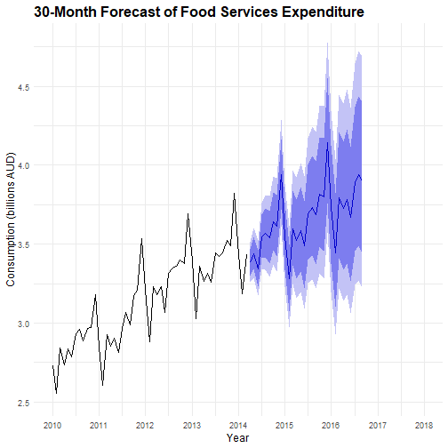

## Loading Packages and Data


```r
library(forecast)
library(ggplot2)
source("BoxCoxTransformation.R")
require(astsa)
source("Diagnostic.R")
require(portes)
```

Importing the time series data


```r
data = read.table("data9.txt", header = TRUE)
```

## Exploratory Data Analysis (EDA)
Creating the time series object


```r
z <- ts(data[,1], start = c(1980, 4), frequency = 12)
```

### Original Series Visualization


```r
ts.plot(z, main = "Total Monthly Expenditure on Cafes, Restaurants and Takeaway Food Services in Australia (Apr 1980 - Apr 2015)", 
        ylab = "Consumption (in billions of dollars)", 
        xlim = c(1980, 2016))
```


### Seasonal Plot


```r
ggseasonplot(z, main = "Seasonal Plot: Monthly Food Services Expenditure", 
             year.labels = TRUE, year.labels.left = TRUE) +
  theme(legend.position = "bottom")
```


**Initial observations:**
- Clear upward trend component
- Annual seasonality evident (s=12)
- Increasing variance over time (heteroscedasticity)
- Need for variance-stabilizing transformation
## Box-Cox Transformation


```r
Plot.var(z, 12)
```


```r
BoxCox(z, 12)
```


**Transformation results:**
- Optimal lambda = 0.2
- Not close enough to zero for log transformation


```r
X.tilde = (z**0.2 - 1)/0.2
ts.plot(X.tilde, main = "Box-Cox Transformed Series (λ=0.2)", 
        xlim = c(1980, 2016))
```


### Autocorrelation Function (ACF)


```r
Acf(X.tilde, lag.max = 72, 
    main = "ACF of the Transformed Series", 
    xlab = "Lag (months)", ylab = "ACF")
```


## Differencing for Stationarity
### First Regular Difference


```r
Wt.1 = diff(X.tilde, lag = 1, differences = 1)
ts.plot(Wt.1, 
        main = "First Regular Difference of Transformed Series", 
        xlim = c(1980, 2016))
```


### First Seasonal Difference


```r
Wt.2 = diff(Wt.1, lag = 12, differences = 1)
ts.plot(Wt.2, 
        main = "Regular and Seasonal Differences (1,1)", 
        xlim = c(1980, 2016))
```


### ACF and PACF of Differenced Series


```r
par(mfrow = c(2, 1))
Acf(Wt.2, lag.max = 72, 
    main = "ACF: Regular and Seasonal Differences", 
    xlab = "Lag (months)", ylab = "ACF")
Pacf(Wt.2, lag.max = 72, 
     main = "PACF: Regular and Seasonal Differences", 
     xlab = "Lag (months)", ylab = "PACF")
```


```r
par(mfrow = c(1, 1))
```

**Model identification:**
- Regular MA(1) component (lag 1 spike)
- Seasonal MA(1) component (lag 12 spike)
- Possible seasonal AR component (geometric decay at seasonal lags)
- Significant spike at lag 24 suggests SMA(2) component
## SARIMA Model Fitting
Fitting candidate SARIMA models


```r
mod1 = Arima(z, order = c(2,1,1), seasonal = list(order = c(3,1,1), period = 12), lambda = 0.2)
mod2 = Arima(z, order = c(2,1,1), seasonal = list(order = c(5,1,1), period = 12), lambda = 0.2)
mod3 = Arima(z, order = c(3,1,1), seasonal = list(order = c(3,1,1), period = 12), lambda = 0.2)
mod4 = Arima(z, order = c(0,1,1), seasonal = list(order = c(2,1,2), period = 12), lambda = 0.2)
mod5 = Arima(z, order = c(0,1,1), seasonal = list(order = c(3,1,1), period = 12), lambda = 0.2)
mod6 = Arima(z, order = c(0,1,1), seasonal = list(order = c(3,1,2), period = 12), lambda = 0.2)
mod7 = Arima(z, order = c(1,1,0), seasonal = list(order = c(3,1,1), period = 12), lambda = 0.2)

models <- list(mod1, mod2, mod3, mod4, mod5, mod6, mod7)
names(models) <- paste0("mod", 1:7)
```

## Model Comparison
Creating comparison table


```r
results_table <- data.frame()
for (name in names(models)) {
  mod <- models[[name]]
  acc <- accuracy(mod)
  
  rmse_val <- acc["Training set", "RMSE"]
  
  results_table <- rbind(results_table, data.frame(
    Model = name,
    AIC = round(mod$aic, 2),
    AICc = round(mod$aicc, 2),
    BIC = round(mod$bic, 2),
    RMSE = round(rmse_val, 6),
    MAE = round(acc["Training set", "MAE"], 4)
  ))
}
```

### Model Metrics Comparison Table


```r
library(dplyr)
library(kableExtra)

best_AIC <- min(results_table$AIC)
best_AICc <- min(results_table$AICc)
best_BIC <- min(results_table$BIC)
best_RMSE <- min(results_table$RMSE)
best_MAE <- min(results_table$MAE)
```

## Residual Diagnostics
### Custom Ljung-Box Tests


```r
My.Ljung.Box.FixedK <- function(x, np, k) {
  n <- length(x)
  SampleACF <- as.numeric(Acf(x, lag.max = k, plot = FALSE)$acf)[2:(k + 1)]
  Q.ML <- n * (n + 2) * sum((SampleACF^2) / (n - seq_len(k)))
  pval <- 1 - pchisq(Q.ML, df = k - np)
  data.frame(k = k, Test_Statistic = Q.ML, P_value = pval)
}
```

### Non-parametric Tests


```r
NonParametric.Tests(mod2$residuals)    
```

```
##                      Test Statistic    P-value
## Turning Point test       0.03922624 0.96871001
## Difference-sign Test     1.79853241 0.07209268
## Rank Test                0.26016592 0.79473579
```

```r
NonParametric.Tests(mod3$residuals)    
```

```
##                      Test Statistic   P-value
## Turning Point test        0.4314887 0.6661131
## Difference-sign Test      0.4282220 0.6684895
## Rank Test                 0.2267368 0.8206284
```

```r
NonParametric.Tests(mod5$residuals)    
```

```
##                      Test Statistic   P-value
## Turning Point test        0.6668462 0.5048704
## Difference-sign Test      0.0856444 0.9317491
## Rank Test                 0.1671457 0.8672554
```

### Normality Tests


```r
Check.normality(mod2$residuals)
```

```
##                    Statistics P-value
## Shapiro-Wilxs          0.9957  0.3232
## Lilliefors             0.0434  0.0634
## Pearson Chi.square    24.8284  0.2081
```

```r
Check.normality(mod3$residuals)
```


```
##                    Statistics P-value
## Shapiro-Wilxs          0.9959  0.3787
## Lilliefors             0.0412  0.0943
## Pearson Chi.square    19.6422  0.4805
```

```r
Check.normality(mod5$residuals)
```


```
##                    Statistics P-value
## Shapiro-Wilxs          0.9965  0.5068
## Lilliefors             0.0294  0.5294
## Pearson Chi.square    14.4559  0.8067
```


## Validation and Forecasting
### Observed vs Fitted Values (Model 3)


```r
plot(window(z, start = c(2010, 1)), 
     ylab = "Consumption (billions AUD)",
     xlab = "", type = "l", lwd = 1.5,
     main = "Model 3: Actual vs Fitted Values (2010-2015)")
lines(window(fitted(mod3), start = c(2010, 1)), 
      col = "red", lwd = 1.5)
legend("topleft", legend = c("Actual", "Fitted"), 
       col = c("black", "red"), lty = 1, lwd = 1.5)
```


### 30-Month Forecast (Starting from 2010)


```r
Predic.mod = forecast(mod3, h = 30)

# Create plot starting from 2010
autoplot(Predic.mod, include = 5*12,  # Show last 5 years of historical data
         main = "30-Month Forecast of Food Services Expenditure",
         ylab = "Consumption (billions AUD)",
         xlab = "Year") +
  theme_minimal() +
  scale_x_continuous(limits = c(2010, 2018), 
                     breaks = seq(2010, 2018, by = 1)) +
  theme(legend.position = "bottom",
        plot.title = element_text(size = 16, face = "bold"),
        axis.title = element_text(size = 12))
```

```
## Scale for x is already present.
## Adding another scale for x, which will replace the existing scale.
```

```
## Warning: Removed 9 rows containing missing values or values outside the scale range
## (`geom_line()`).
```



